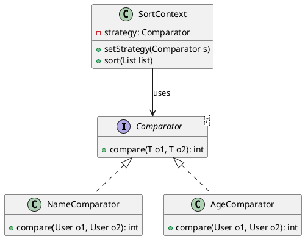
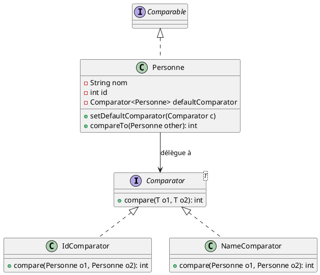
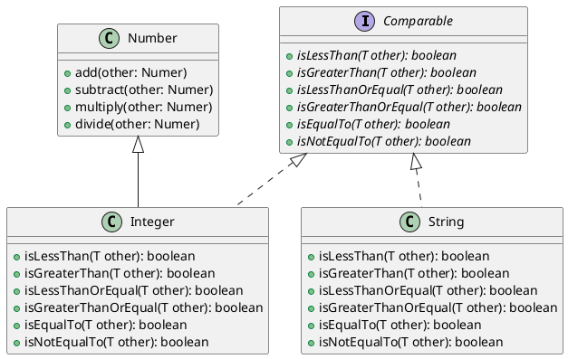
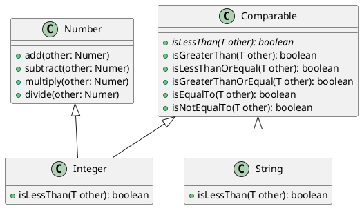

# Le Patron de Conception _Stratégie_

## 1. Discussion Générale : Le Concept

### Qu'est-ce que le patron Stratégie ?

Le patron **Stratégie** est un patron de conception *comportemental*. Son objectif principal est de définir une famille
d'algorithmes, de les encapsuler chacun dans une classe séparée, et de les rendre interchangeables.

L'idée fondamentale est de **séparer l'algorithme utilisé du client qui l'utilise**.

### Pourquoi l'utiliser ?

Imaginons un logiciel qui doit effectuer un calcul de frais de livraison. Selon le transporteur (Poste, DHL, FedEx), le
calcul est différent.

- **Sans le patron Stratégie :** On utiliserait une structure `if/else` ou `switch` massive à l'intérieur de la méthode
  de calcul. À chaque nouveau transporteur, on doit modifier le code existant, ce qui risque d'introduire des bugs
  (violation du principe *Open/Closed* du SOLID).
- **Avec le patron Stratégie :** On crée une interface "Stratégie de Livraison". Chaque transporteur devient une classe
  qui implémente cette interface. Le logiciel principal se contente d'appeler la méthode `calculer()`, sans se soucier
  de *comment* le calcul est fait.

### Avantages clés :

- **Flexibilité :** On peut changer d'algorithme à l'exécution (runtime).
- **Maintenabilité :** Chaque algorithme est isolé dans sa propre classe.
- **Évolutivité :** On peut ajouter de nouvelles stratégies sans modifier le code existant.

---

## 2. Étude de cas : Le problème du Tri

Le tri est l'exemple parfait pour illustrer ce patron.

### Le dilemme du tri

Un algorithme de tri (comme le *QuickSort* ou le *MergeSort*) est très efficace pour déplacer des éléments dans une
liste. Cependant, l'algorithme de tri possède une lacune : **il ne sait pas comment comparer deux éléments.**

Si on trie une liste d'entiers, on utilise l'opérateur `<`. Mais si on trie :

- Une liste d'Objets `Utilisateur` (par nom ? par âge ? par date d'inscription ?)
- Une liste de `Produits` (par prix croissant ? par prix décroissant ?)

L'algorithme de tri (la logique de déplacement) doit être **indépendant** du critère de comparaison (la logique de
décision). Le critère de comparaison est donc notre **Stratégie**.

---

## 3. Spécification Technique (Contexte Java / OO)

Pour résoudre ce problème, on introduit une interface qui définit le contrat de comparaison.

### L'interface `Comparable` et `Comparator`

En Java, on distingue deux approches :

1. **`Comparable`** : L'objet sait se comparer lui-même à un autre (ordre naturel).
2. **`Comparator`** : Un objet externe définit comment comparer deux autres objets (c'est ici que réside le patron
   Stratégie).

C'est le `Comparator` qui agit comme la **Stratégie**.

### Diagramme de classes UML

Voici la représentation du patron appliqué au tri :



**Explication du diagramme :**

- `Comparator` est l' **Interface de Stratégie**.
- `NameComparator` et `AgeComparator` sont les **Stratégies Concrètes**.
- `SortContext` (qui représente notre algorithme de tri) est le **Contexte**. Il ne connaît pas les détails du tri, il
  utilise simplement l'interface.

---

## 4. Lien avec le tri d'une collection

Maintenant, faisons le lien avec l'exécution.

Lorsqu'on appelle une méthode de tri (comme `Collections.sort()` en Java), on lui passe deux choses :

1. **La collection** d'éléments à trier.
2. **Une instance de Stratégie** (le `Comparator`).

### Le flux d'exécution :

1. L'algorithme de tri commence à parcourir la liste.
2. Lorsqu'il doit décider si l'élément A doit être placé avant l'élément B, il ne fait pas de test `if (A < B)`.
3. Il appelle la stratégie : `strategie.compare(A, B)`.
4. La stratégie retourne un entier :
    - **Négatif** : A est "plus petit" que B.
    - **Zéro** : A et B sont équivalents.
    - **Positif** : A est "plus grand" que B.
5. L'algorithme de tri déplace les éléments en fonction de ce résultat, sans jamais avoir su *pourquoi* l'un était
   considéré comme plus grand que l'autre.

**Résultat :** On peut utiliser le même algorithme de tri pour n'importe quel type d'objet, simplement en changeant la
stratégie de comparaison passée en paramètre.

---


## Focus : Ordre Naturel vs Ordre Personnalisé en Java

Avant d'implémenter le patron Stratégie, il est important de comprendre comment Java gère la comparaison d'objets.

### 1. L'interface `Comparable` : L'ordre "Naturel"

L'interface `Comparable<T>` est utilisée pour définir l'**ordre naturel** des objets d'une classe. Quand une classe
implémente `Comparable`, elle dit : *"Je sais comment me comparer à un autre objet de mon type."*

- **La méthode :** Elle doit implémenter `public int compareTo(T other)`.
- **L'usage :** Lorsqu'une liste d'objets `Comparable` est passée à `Collections.sort(list)`, Java utilise
  automatiquement la méthode `compareTo` de chaque objet.

#### Pourquoi les `Integer` ou `String` sont-ils triables sans effort ?

Si vous triez une `ArrayList<Integer>`, vous n'avez rien à coder. Pourquoi ? Parce que la classe `Integer` (et `String`,
`Double`, etc.) **implémente déjà l'interface `Comparable`**.

- Pour `Integer`, l'ordre naturel est numérique (1 < 2 < 3).
- Pour `String`, l'ordre naturel est alphabétique.

#### Le cas des classes personnalisées

Si vous créez une classe `Etudiant`, Java ne peut pas deviner l'ordre naturel. Doit-il trier par nom ? Par numéro
d'étudiant ? Par moyenne ? Tant que la classe `Etudiant` n'implémente pas `Comparable`, toute tentative d'utiliser
`Collections.sort()` provoquera une erreur de compilation.

**Exemple de concept :**

```java
public class Etudiant implements Comparable<Etudiant> {
    private int id;
    private String nom;

    @Override
    public int compareTo(Etudiant autre) {
        // On définit que l'ordre naturel est basé sur l'ID
        return this.id - autre.id; 
    }
}
```

---

### 2. L'interface `Comparator` : La stratégie de tri externe

L'interface `Comparable` est limitée : **on ne peut définir qu'un seul ordre naturel**. Mais que se passe-t-il si, dans
une application, on a besoin de trier les étudiants par nom à un moment, et par moyenne à un autre ?

C'est là qu'intervient `Comparator<T>`. Contrairement à `Comparable`, le `Comparator` est une **classe distincte** qui
compare deux autres objets.

- **La méthode :** Elle implémente `public int compare(T o1, T o2)`.
- **L'usage :** On passe l'instance du `Comparator` en deuxième argument : `Collections.sort(list, monComparator)`.

### 3. Synthèse : Comparable vs Comparator

| Caractéristique         | `Comparable`                                | `Comparator`                                    |
|:------------------------|:--------------------------------------------|:------------------------------------------------|
| **Rôle**                | Définit l'ordre **intrinsèque** (naturel).  | Définit un ordre **extrinsèque** (critère).     |
| **Méthode**             | `compareTo(T other)`                        | `compare(T o1, T o2)`                           |
| **Modification**        | Nécessite de modifier la classe de l'objet. | On crée une nouvelle classe (ou lambda).        |
| **Flexibilité**         | Un seul tri possible par classe.            | Autant de tris que de Comparators créés.        |
| **Lien Design Pattern** | Simple implémentation d'interface.          | **C'est l'implémentation du patron Stratégie.** |

---

### Le pont vers le Patron Stratégie

C'est ici que nous faisons le lien :
Le `Comparator` est une **Stratégie**. L'algorithme de tri (le contexte) ne sait pas comment comparer les objets ; il
délègue cette responsabilité à l'objet `Comparator` que nous lui fournissons.

En changeant l'objet `Comparator` passé à la méthode de tri, on change la **stratégie de comparaison** sans jamais
modifier le code de l'algorithme de tri lui-même.


## Exemple en Java
        
```java
import java.util.*;

// =========================================================================
// 1. LA CLASSE MÉTIER
// =========================================================================
// Implémente Comparable pour définir l'ORDRE NATUREL (par ID)
class Personne implements Comparable<Personne> {
    private final int id;
    private final String nom;
    private final int age;

    public Personne(int id, String nom, int age) {
        this.id = id;
        this.nom = nom;
        this.age = age;
    }

    public int getId() { return id; }
    public String getNom() { return nom; }
    public int getAge() { return age; }

    // Implémentation de Comparable : On définit l'ordre par défaut (ID)
    @Override
    public int compareTo(Personne autre) {
        // Utilisation de Integer.compare pour éviter les problèmes d'overflow 
        // par rapport à une simple soustraction (this.id - autre.id)
        return Integer.compare(this.id, autre.id);
    }

    @Override
    public String toString() {
        return String.format("Personne[ID=%d, Nom='%s', Age=%d]", id, nom, age);
    }
}

// =========================================================================
// 2. STRATÉGIES DE TRI (Comparators classiques)
// =========================================================================

// Stratégie pour trier par nom (ordre alphabétique)
class NameComparator implements Comparator<Personne> {
    @Override
    public int compare(Personne p1, Personne p2) {
        return p1.getNom().compareTo(p2.getNom());
    }
}

// Stratégie pour trier par âge (croissant)
class AgeComparator implements Comparator<Personne> {
    @Override
    public int compare(Personne p1, Personne p2) {
        return Integer.compare(p1.getAge(), p2.getAge());
    }
}

// =========================================================================
// 3. TEST ET DÉMONSTRATION
// =========================================================================
public class StrategyPatternDemo {
    public static void main(String[] args) {
        List<Personne> personnes = new ArrayList<>();
        personnes.add(new Personne(103, "Charlie", 25));
        personnes.add(new Personne(101, "Alice", 30));
        personnes.add(new Personne(102, "Bob", 20));
        personnes.add(new Personne(104, "Diane", 22));

        System.out.println("--- Liste originale ---");
        personnes.forEach(System.out::println);

        // --- CAS 1 : Utilisation de Comparable (Ordre Naturel : ID) ---
        // Collections.sort(list) utilise automatiquement le compareTo() de Personne
        Collections.sort(personnes);
        System.out.println("\n--- Tri par ID (Comparable / Ordre Naturel) ---");
        personnes.forEach(System.out::println);

        // --- CAS 2 : Utilisation de Comparator classique (Stratégie : Nom) ---
        Collections.sort(personnes, new NameComparator());
        System.out.println("\n--- Tri par Nom (Comparator classique) ---");
        personnes.forEach(System.out::println);

        // --- CAS 3 : Utilisation de Comparator classique (Stratégie : Age) ---
        Collections.sort(personnes, new AgeComparator());
        System.out.println("\n--- Tri par Age croissant (Comparator classique) ---");
        personnes.forEach(System.out::println);

        // =========================================================================
        // APPROCHE MODERNE (JAVA 8+) : LAMBDAS ET MÉTHODES DE CONVENANCE
        // =========================================================================

        // Tri par âge décroissant utilisant une Lambda
        // (p1, p2) -> ... est l'implémentation "à la volée" de l'interface Comparator
        personnes.sort((p1, p2) -> Integer.compare(p2.getAge(), p1.getAge()));
        System.out.println("\n--- Tri par Age décroissant (Lambda) ---");
        personnes.forEach(System.out::println);

        // Tri par nom utilisant la méthode statique Comparator.comparing (encore plus court)
        // C'est l'ultime simplification du patron Stratégie
        personnes.sort(Comparator.comparing(Personne::getNom).reversed());
        System.out.println("\n--- Tri par Nom décroissant (Comparator.comparing + reversed) ---");
        personnes.forEach(System.out::println);
    }
}
```

### Points clés

1.  **L'Ordre Naturel (`Comparable`)** : 
    - L'appel `Collections.sort(personnes)` ne prend qu'un seul argument. Java "regarde" si la classe `Personne` 
      implémente `Comparable`. C'est l'identité de l'objet.

2.  **Le Patron Stratégie (`Comparator`)** :
    - `NameComparator` et `AgeComparator` sont des classes de stratégie. Elles sont interchangeables. On peut 
      passer l'une ou l'autre à `Collections.sort()`. L'algorithme de tri ne change pas, seule la stratégie de décision
      change.

3.  **L'évolution vers le Fonctionnel** :
    - Une fonction lamda `(p1, p2) -> Integer.compare(p2.getAge(), p1.getAge())` fait exactement la même chose que de
      créer une classe `AgeDescComparator` avec une méthode `compare`. La fonction lamda est plus concise et évite la 
      création d'une classe supplémentaire. Elle est automatiquement transformée en une instance de `Comparator`. On dit
      que la fonction lamda est une *instance fonctionnelle* de `Comparator`, et que `Comparator` est une 
      *interface fonctionnelle*.
    - L'utilisation de `Comparator.comparing(Personne::getNom)` montre comment Java a industrialisé le patron Stratégie
      pour réduire le code inutile (*boilerplate code*).

4.  **Complexité Temporelle/Spatiale** :
    - Peu importe la stratégie utilisée, la complexité de l'algorithme de tri (généralement un *Timsort* en Java) reste
      la même. Seul le coût de la comparaison change légèrement.

---

## Concept Avancé : La Délégation de la Comparaison

Jusqu'à présent, nous avons vu que `Comparable` définit un ordre fixe (codé en dur dans la méthode `compareTo`).
Cependant, pour un design encore plus flexible, on peut décider que l'objet `Comparable` ne doit pas décider lui-même de
la logique de comparaison, mais doit la **déléguer** à un `Comparator`.

### Le principe de délégation

Au lieu d'écrire la logique de comparaison directement dans `compareTo`, la classe détient une référence vers une
instance de `Comparator`. La méthode `compareTo` devient alors un simple "passe-plat".

**L'idée :** L'objet possède une "stratégie de tri par défaut", mais cette stratégie peut être modifiée dynamiquement.

### Implémentation Conceptuelle (Java)

```java
public class Personne implements Comparable<Personne> {
    private String nom;
    private int id;

    // On définit un Comparator par défaut (Stratégie initiale)
    private Comparator<Personne> defaultComparator = new IdComparator();

    // Permet de changer la stratégie de tri par défaut à la volée
    public void setDefaultComparator(Comparator<Personne> newComparator) {
        this.defaultComparator = newComparator;
    }

    @Override
    public int compareTo(Personne autre) {
        // Délégation : je ne compare pas moi-même, 
        // je demande à ma stratégie actuelle de le faire.
        return this.defaultComparator.compare(this, autre);
    }
}
```

### Mise à jour du Diagramme UML

Le diagramme évolue : la classe `Personne` n'est plus seulement une entité, elle devient le **Contexte** du patron
Stratégie.



---

### Discussion : Pourquoi faire cela ?

#### 1. Avantages :

- **Flexibilité totale :** On peut changer le comportement de `compareTo` sans modifier le code de la classe `Personne`
  et sans avoir à créer de nouvelles sous-classes.
- **Découplage :** La logique de "comment on trie" est totalement extraite de la logique de "ce qu'est une Personne".

#### 2. Le point d'attention (Le "Piège") :

C'est ici que tu peux introduire une notion critique sur la **cohérence**.

!!! warning "Attention" 
    Si chaque objet `Personne` possède son propre `Comparator` et qu'on les change individuellement, on
    risque de briser le contrat de `Comparable`.
    
    Si `personneA.compareTo(personneB)` utilise le tri par **Nom**, mais que `personneB.compareTo(personneA)` utilise le
    tri par **ID**, l'algorithme de tri (comme `Collections.sort`) risque de produire des résultats imprévisibles ou de
    planter (car le résultat n'est plus symétrique).

**La solution recommandée :**
Pour éviter ce problème, le `defaultComparator` devrait idéalement être **statique** (partagé par toutes les instances
de la classe) ou être géré par un gestionnaire de configuration global. Ainsi, quand on change la stratégie, on la
change pour tous les objets de ce type simultanément.

---

### Résumé pour les étudiants :

- **`Comparable` sans délégation** $\rightarrow$ Ordre naturel fixe (Rigide).
- **`Comparator` seul** $\rightarrow$ Ordres multiples possibles, mais on doit passer le comparator manuellement à
  chaque tri (Externe).
- **`Comparable` avec délégation vers `Comparator`** $\rightarrow$ Ordre naturel flexible et configurable (Design
  Pattern Stratégie complet).

---

## L'Évolution : Du Patron "Classe" au Patron "Fonction"

Dans les versions traditionnelles de la programmation orientée objet (OO) d'il y a 20 ou 25 ans ou plus, pour 
implémenter une stratégie, on était obligé de créer une classe complète, même si celle-ci ne contenait qu'une seule 
méthode.

### 1. Le problème de "l'explosion des classes"

L'approche OO pure peut mener à ce qu'on appelle l' **explosion des classes**. Imaginez une application où vous avez
besoin de 50 critères de tri différents. Créer 50 fichiers `.java` (ex: `TriNomComparator`, `TriDateComparator`,
`TriPrixComparator`...) rend le projet lourd, difficile à naviguer et verbeux.

### 2. La solution : L'intégration du paradigme Fonctionnel

Les langages OO modernes (Java 8+, Python, C#, etc.) ont intégré des concepts de programmation fonctionnelle pour
simplifier ces structures.

En Java, le `Comparator` est ce qu'on appelle une **Interface Fonctionnelle** (une interface qui ne possède qu'une seule
méthode abstraite). Cela permet d'utiliser des **expressions Lambda**.

#### Exemple : Du concret au fonctionnel

Au lieu de créer une classe `NameComparator`, on passe directement la logique de comparaison à la méthode de tri :

```java
// Approche traditionnelle (OO pure)
Collections.sort(listePersonnes, new NameComparator());

// Approche moderne (Lambda)
Collections.sort(listePersonnes, (p1, p2) -> p1.getNom().compareTo(p2.getNom()));
```

**Ce qui change :**
L'objet "Stratégie" existe toujours techniquement (Java crée une instance anonyme en arrière-plan), mais pour le
développeur, la stratégie est devenue une simple **fonction**. On a supprimé la structure bureaucratique (la classe)
pour ne garder que le comportement (le code).

---

### 3. Perspective Multi-langage : Le cas de Python

Dans des langages comme Python, cette approche est encore plus naturelle car les fonctions sont des **objets de première
classe**. Une fonction est un objet "callable" (appelable).

Le patron Stratégie est ainsi intégré nativement dans la signature des fonctions de tri via l'argument `key`.

```python
# Exemple Python : on passe une fonction (lambda) comme stratégie de tri
personnes = [{"nom": "Alice", "age": 30}, {"nom": "Bob", "age": 25}]

# Stratégie : trier par âge
personnes.sort(key=lambda p: p["age"])
```

Ici, la "stratégie" est simplement la fonction lambda `lambda p: p["age"]`. Le moteur de tri de Python utilise cette
fonction pour extraire la valeur à comparer.

---

### 4. Synthèse : L'évolution des Patrons de Conception

Il est crucial de comprendre que les patrons de conception ne sont pas des règles immuables, mais des solutions à des
problèmes de langages d'une époque donnée.

L'évolution vers le multi-paradigme a simplifié plusieurs patrons classiques :

| Patron Classique (OO) | Évolution Moderne (Fonctionnelle)              | Simplification                                                                       |
|:----------------------|:-----------------------------------------------|:-------------------------------------------------------------------------------------|
| **Stratégie**         | $\rightarrow$ Lambdas / Fonctions              | Plus besoin de classes pour chaque algorithme.                                       |
| **Observateur**       | $\rightarrow$ Streams / Programmation Réactive | On s'abonne à un flux de données plutôt que de gérer des listes d'objets `Observer`. |
| **Commande**          | $\rightarrow$ Closures / Callbacks             | La "commande" est simplement une fonction stockée dans une variable.                 |

!!! note "Note"
    L'OO reste indispensable pour structurer les données et les domaines complexes, mais le paradigme fonctionnel est
    l'outil idéal pour injecter des comportements. **Le bon développeur moderne sait jongler entre les deux : utiliser des
    classes pour l'état et la structure, et des fonctions pour la logique et les stratégies.**


---

## Réflexion sur le Design : Héritage vs Capacités

Lorsqu'on conçoit un système de comparaison, on peut être tenté d'utiliser l'héritage pour éviter la duplication de
code. Analysons pourquoi l'approche moderne privilégie les interfaces et la composition plutôt que l'héritage multiple.

### 1. "Est un" (Is-a) vs "Possède la capacité de" (Can-do)

En programmation OO, l'héritage doit représenter une relation de type **"Est un"**.

- *Exemple :* Un `Chat` **est un** `Animal`. Cela a du sens.
- *Problème :* Une `Personne` n'**est pas _un_** `Comparable`. Le fait d'être comparable n'est pas l'essence de ce qu'est
  une personne, c'est une **capacité** (un comportement) que l'on lui ajoute.
- On pourrait dire qu'une `Personne` **est** `Comparable` en terme de fonctionnalité, mais pas **UN** `Comparable`.
- `Comparable` ne représente pas l'identité d'un objet, mais une capacité qu'il peut avoir. Normalement, on utilise un 
  nom pour nommer une classe, et un adjectif pour nommer une interface, à moins qu'une interface représente un rôle 
  (ex. `Comparator`, voir plus bas).

Confondre l'identité d'un objet avec ses capacités mène souvent à des hiérarchies de classes rigides et fragiles. On
préfère donc utiliser une **Interface** : on ne dit pas que l'objet *est* un Comparable, mais qu'il *implémente* le
contrat de comparaison. Dans la langue française, et probablement dans d'autres langues également, la différence est 
subtile : _"est **un** Comparable"_ vs. _"est Compable"_.

#### L'Interface comme "Capacité" $\rightarrow$ L'Adjectif

Quand l'interface définit une propriété ou une aptitude que l'objet possède, on utilise effectivement un **adjectif**. 
En Java, cela se traduit très souvent par le suffixe **"-able"** (en anglais).

*   **`Comparable`** : L'objet est *comparable* (il possède la capacité d'être comparé).
*   **`Serializable`** : L'objet est *sérialisable* (il possède la capacité d'être converti en flux d'octets).
*   **`Cloneable`** : L'objet est *clonable*.
*   **`Runnable`** : L'objet est *exécutable*.

**L'idée derrière :** On ne dit pas que l'objet *est* un Comparable (comme on dirait qu'une Personne *est* un Humain), 
mais qu'il *est capable d'être* comparé.

#### L'Interface comme "Rôle" $\rightarrow$ Le Nom

Quand l'interface définit un **contrat de comportement** ou un rôle spécifique dans une architecture (comme dans les 
patrons de conception), on utilise souvent un **nom**. Ce nom décrit l'agent qui effectue l'action.

*   **`Comparator`** : C'est l'objet qui *fait* la comparaison (le Comparateur).
*   **`Strategy`** : C'est l'objet qui *est* la stratégie.
*   **`Observer`** : C'est l'objet qui *est* l'observateur.
*   **`List`** : C'est un objet qui *est* une liste.

**L'idée derrière :** Ici, l'interface ne décrit pas une qualité de l'objet, mais sa fonction dans le système.
Par exemples, les instances des implémentations de `Comparator` sont des objets qui *font* la comparaison, qui
sont spécialisés dans la comparaison d'objets, donc leur rôle sera *de faire la comparaison*.

---

### Synthèse

| Type de composant        | Nature du nom | Question à se poser        | Exemple                  |
|:-------------------------|:--------------|:---------------------------|:-------------------------|
| **Classe**               | **Nom**       | "Qu'est-ce que c'est ?"    | `Personne`, `Voiture`    |
| **Interface (Capacité)** | **Adjectif**  | "De quoi est-il capable ?" | `Comparable`, `Iterable` |
| **Interface (Rôle)**     | **Nom**       | "Quel rôle joue-t-il ?"    | `Comparator`, `Strategy` |


### 2. La gestion de la duplication : Méthodes par défaut

Une critique courante de l'utilisation des interfaces est qu'elles obligeraient à réimplémenter tous les opérateurs de
comparaison (`<`, `>`, `<=`, `>=`, `==`) dans chaque classe, créant ainsi une duplication de code.

Cependant, les langages modernes ont résolu ce problème sans passer par l'héritage de classes :

- **En Java :** Les `default methods` dans les interfaces permettent de fournir une implémentation concrète. On peut
  définir une méthode `compare()` et utiliser des méthodes par défaut pour dériver les autres comportements, tout en
  restant dans le cadre d'une interface.
- **En Python :** Le langage est conçu pour être minimaliste. Pour trier une liste, Python n'a besoin que d'une seule
  méthode (`__lt__` pour *less than*). Si vous définissez `__lt__`, Python peut souvent en déduire les autres
  comportements ou simplement ignorer ceux dont il n'a pas besoin pour l'algorithme de tri.

#### Diagramme 1 : L'approche par Interface (Le problème de la duplication)

Dans ce scénario, l'interface définit un contrat complet. Chaque classe qui veut être comparable doit implémenter les 6 
opérateurs, ce qui crée du code redondant.



---

#### Diagramme 2 : L'approche par Héritage Multiple (La solution proposée)

Ici, on transforme l'interface en classe pour centraliser la logique. Seul l'opérateur `<` reste abstrait ; les 5 
autres sont implémentés une seule fois dans la classe `Comparable`.



---

#### 1. L'Intention derrière ce choix

L'objectif principal est l'application du principe **DRY (*Don't Repeat Yourself*)**. 

L'idée est la suivante : mathématiquement, si l'on sait définir "est plus petit que" (`<`), on peut déduire toutes les 
autres comparaisons. 
- `A > B` est équivalent à `B < A`.
- `A == B` est équivalent à `!(A < B) && !(B < A)`.

En déplaçant cette logique dans une classe mère (`Comparable`), on évite que `Integer`, `String`, `Double`, `Date`,
etc., ne doivent tous réécrire les mêmes 5 méthodes. On réduit ainsi la quantité de code et on centralise la 
maintenance.

---

#### 2. Critique du choix de l'héritage multiple

Bien que l'intention soit louable, cette approche pose plusieurs problèmes fondamentaux au regard des principes de 
design modernes et des sections précédentes de ton cours :

##### A. Confusion sémantique ("Is-a" vs "Can-do")

L'héritage doit représenter une relation de type. 
- `Integer` **est un** `Number` $\rightarrow$ Cohérent.
- `Integer` **est un** `Comparable` $\rightarrow$ Problématique.

- Le fait d'être comparable est une **capacité** (un comportement), pas une nature. En transformant `Comparable` en 
classe, on force l'objet à adopter une identité qu'il n'a pas.

##### B. Rigidité et fragilité (Le problème de l'héritage multiple)

L'héritage multiple introduit une complexité technique et architecturale :
1. **Le problème du Diamant :** Si `Number` et `Comparable` héritaient tous deux d'une même classe `BaseObject`, 
   `Integer` hériterait deux fois de `BaseObject`, créant des ambiguïtés sur quelle méthode appeler.
2. **Interdiction dans certains langages :** Java interdit l'héritage multiple de classes précisément pour éviter ce 
   chaos. En restant sur des interfaces, on peut implémenter autant de contrats que l'on veut sans risque.

##### C. Violation des principes SOLID

- **SRP (Responsabilité Unique) :** La classe `Comparable` ne se contente plus de définir un contrat ; elle devient 
  responsable de la logique mathématique de comparaison pour tous les types d'objets du système.
- **LSP (Liskov Substitution Principle) :** On risque de créer des situations où un objet héritant de `Comparable` ne 
  se comporte pas comme attendu par le reste du système si la logique centralisée dans la classe mère ne convient pas 
  à tous les types (ex: la comparaison de chaînes de caractères vs nombres).

##### D. Alternatives modernes et plus souples

L'argument de la "duplication de code" est aujourd'hui obsolète grâce à :
1.  **Les Méthodes par Défaut (Default Methods) :** En Java 8+, on peut laisser `Comparable` comme une **interface** et
    y écrire les 5 méthodes concrètes. On obtient le même bénéfice (pas de duplication) sans les risques de l'héritage 
    multiple.
2.  **Le Patron Stratégie (Comparator) :** Plutôt que de forcer `Integer` à hériter d'une logique de tri, on crée un 
    `Comparator`. Cela permet de changer la stratégie de tri sans modifier la hiérarchie des classes.
3.  **L'Approche Fonctionnelle :** L'utilisation de lambdas permet de définir la règle de comparaison au moment de 
    l'appel, éliminant totalement le besoin de créer des classes de base pour "sauver" quelques lignes de code.


### 3. Le risque de l'héritage multiple

L'héritage multiple (présent en C++ ou Python) peut sembler attrayant pour "fusionner" des fonctionnalités, mais il
introduit des complexités majeures (comme le problème du diamant en C++).

En privilégiant la **Composition** ou l'utilisation de **Comparators (Stratégies)**, on obtient les mêmes avantages
(réutilisation du code) sans les risques :

1. On ne pollue pas la hiérarchie de classes de l'objet métier.
2. On peut changer la logique de comparaison sans toucher à la classe d'origine.
3. On évite les conflits de noms et les ambiguïtés d'héritage.

### Synthèse comparative

| Approche                   | Mécanisme                             | Philosophie                                           | Risque                                                         |
|:---------------------------|:--------------------------------------|:------------------------------------------------------|:---------------------------------------------------------------|
| **Héritage Classique**     | Classe Base $\rightarrow$ Sous-classe | "L'objet est un type de comparateur"                  | Hiérarchie rigide, explosion des classes, conflits d'héritage. |
| **Interface / Capacité**   | Implémentation d'Interface            | "L'objet possède la capacité d'être comparé"          | Moins de structure, mais plus de flexibilité.                  |
| **Stratégie (Comparator)** | Composition / Lambda                  | "Un objet externe sait comment comparer ces éléments" | Aucun impact sur la structure de la classe métier.             |

**Conclusion pour le design :**
L'évolution du génie logiciel montre une tendance claire : **"Favoriser la composition par rapport à l'héritage"**, 
comme recommandé par la GoF qui a écrit le livre _Design Patterns_. En
utilisant des interfaces fonctionnelles et le patron Stratégie, on sépare proprement les données (l'objet `Personne`) de
la logique de manipulation (le `Comparator`), rendant le code beaucoup plus facile à maintenir et à faire évoluer.


---

## Étude de Cas : Le Piège de l'Héritage dans les Hiérarchies Complexes

Imaginons la structure suivante :
- Une classe `Personne` (comparée par **ID**).
- Une sous-classe `Etudiant` (comparée par **Moyenne**).
- Une sous-classe `Professeur` (comparée par **Ancienneté**).

### Scénario A : La Rupture de Symétrie (Le chaos polymorphique)

Si on utilise l'approche de l'héritage (où `Personne` hérite de `Comparable` et que les sous-classes redéfinissent 
`isLessThan`), on crée un problème mathématique grave lors du tri d'une liste mixte (`List<Personne>`).

**Le problème :**

Lorsqu'un algorithme de tri compare un `Etudiant` et un `Professeur` :
1. L'algorithme appelle `etudiant.isLessThan(professeur)`. L'objet `Etudiant` utilise sa règle : **la Moyenne**.
2. Plus tard, l'algorithme pourrait appeler `professeur.isLessThan(etudiant)`. L'objet `Professeur` utilise sa règle : 
   **l'Ancienneté**.

**Résultat :**

On se retrouve avec une situation où `A < B` est VRAI et `B > A` est AUSSI VRAI (ou inversement), selon qui est 
l'appelant. 
- L'algorithme de tri devient instable.
- Dans certains langages (comme Java avec `Timsort`), cela peut carrément provoquer une exception 
  (`Comparison contract violation`).

**Conclusion :** L'héritage lie la stratégie de tri à l'**identité** de l'objet. Mais dans une liste polymorphe, on a 
besoin d'une stratégie **unique et cohérente** pour tous les éléments, peu importe leur type.

---

### Scénario B : La Perte de Contrat (Le problème du typage)

Si on décide, pour éviter le problème précédent, que seule la classe `Personne` est `Comparable` et que les sous-classes
n'outrepassent pas la méthode :
- On perd la capacité de trier les étudiants par moyenne ou les professeurs par ancienneté. On est condamné au tri par 
  ID pour tout le monde.

Si on fait l'inverse (seules les sous-classes `Etudiant` et `Professeur` héritent de `Comparable` via l'héritage 
multiple) :
- On ne peut plus trier une `List<Personne>`. Pourquoi ? Parce que le type `Personne` ne garantit pas que l'objet est 
  `Comparable`.
- L'étudiant devra faire des tests de type (`instanceof`) et des casts manuels pour chaque élément de la liste, ce qui 
  est l'opposé même du polymorphisme et du code propre.

---

### La Solution : Le Patron Stratégie (Comparator)

Le patron Stratégie résout nativement ces deux problèmes en **extrayant la logique de tri de la hiérarchie des 
classes**.

Au lieu de demander à l'objet "Comment te compares-tu ?", on utilise un objet externe qui dit "Voici comment je compare
ces deux objets".

**L'approche moderne :**
1.  `Personne`, `Etudiant`, et `Professeur` sont de simples classes de données (POJO).
2.  On crée des stratégies distinctes :
    *   `IdComparator` $\rightarrow$ Trie n'importe quelle `Personne` par ID.
    *   `EtudiantMoyenneComparator` $\rightarrow$ Trie des `Etudiants` par moyenne.
    *   `ProfesseurAncienneteComparator` $\rightarrow$ Trie des `Professeurs` par ancienneté.

**Pourquoi c'est supérieur ?**
- **Cohérence :** Si on trie une liste mixte de personnes, on utilise le `IdComparator`. Chaque élément est traité avec
  la **même règle**, garantissant la symétrie et la stabilité du tri.
- **Flexibilité :** On peut trier la même liste de personnes par ID le matin, et par Nom l'après-midi, sans modifier 
  une seule ligne de code dans les classes `Personne`, `Etudiant` ou `Professeur`.
- **Découplage :** La hiérarchie des classes représente le **domaine** (qui est qui), et les comparateurs représentent 
  les **besoins métiers** (comment on trie).

### Résumé final pour les étudiants :

L'héritage est utile pour partager des attributs et des comportements **intrinsèques**. Mais pour des comportements 
**interchangeables** (comme le tri), l'héritage est un piège. **La composition (via le patron Stratégie) est la seule 
façon de garantir un code flexible, symétrique et évolutif.**


---

## Le Patron Stratégie et les Principes SOLID

L'utilisation du patron Stratégie (et le passage de l'héritage vers la composition/interface) n'est pas seulement une
question de "propreté" du code ; c'est une application concrète des principes **SOLID**. Comprendre ce lien permet aux
étudiants de passer de "l'application d'une recette" à une véritable réflexion d'architecte logiciel.

### 1. SRP : Single Responsibility Principle (Principe de Responsabilité Unique)

Le SRP stipule qu'une classe ne doit avoir qu'une seule raison de changer.

- **Sans Stratégie :** Si la classe `Personne` contient toute la logique de tri (dans un `compareTo` complexe), elle a
  deux responsabilités :
    1. Représenter les données d'une personne (Entité/Domaine).
    2. Définir comment on compare deux personnes (Logique métier). *Si la règle de tri change, on doit modifier la
       classe `Personne`, ce qui est incohérent car les données de la personne n'ont pas changé, seule la règle de tri a
       évolué.*
- **Avec Stratégie :** La classe `Personne` s'occupe uniquement de ses données. La responsabilité de la comparaison est
  déléguée à une classe `Comparator` ou une fonction lambda. Chaque entité a désormais une seule responsabilité.

### 2. OCP : Open/Closed Principle (Principe Ouvert/Fermé)

Une entité logicielle doit être **ouverte à l'extension**, mais **fermée à la modification**.

- **Le problème :** Dans un système rigide, si vous voulez ajouter un nouveau critère de tri (par exemple, trier par
  date de naissance au lieu du nom), vous devriez modifier le code source de la classe `Personne` ou ajouter des
  `if/else` dans votre algorithme de tri.
- **La solution :** Le patron Stratégie rend le système **ouvert** à de nouvelles stratégies de tri (il suffit de créer
  un nouveau `Comparator` ou d'écrire une nouvelle lambda) tout en restant **fermé** à la modification du code existant.
  On ajoute des fonctionnalités sans risquer d'introduire des bugs dans le code qui fonctionne déjà.

### 3. DIP : Dependency Inversion Principle (Principe d'Inversion des Dépendances)

Ce principe suggère que les modules de haut niveau ne doivent pas dépendre des modules de bas niveau, mais
d'abstractions.

- **Application ici :** L'algorithme de tri (le module de haut niveau) ne dépend pas d'une classe concrète comme
  `NameComparator` ou `AgeComparator` (modules de bas niveau). Il dépend uniquement de l'interface `Comparator`.
- **Résultat :** On peut injecter n'importe quelle implémentation de la stratégie au moment de l'exécution. L'algorithme
  de tri est totalement découplé de la logique spécifique de comparaison.

---

### Synthèse

| Principe SOLID | Application au Patron Stratégie                                                           | Bénéfice concret                                          |
|:---------------|:------------------------------------------------------------------------------------------|:----------------------------------------------------------|
| **SRP**        | Séparation entre l'objet métier (`Personne`) et la logique de comparaison (`Comparator`). | Code plus lisible, maintenance simplifiée.                |
| **OCP**        | Ajout de nouveaux tris sans modifier les classes existantes.                              | Évolutivité sans risque de régression.                    |
| **DIP**        | L'algorithme de tri dépend d'une interface, pas d'une classe concrète.                    | Flexibilité totale et interchangeabilité des algorithmes. |

**Conclusion du module :**
Le passage du "OO pur" (héritage lourd) vers une approche basée sur les interfaces et les fonctions (Lambdas) permet
d'implémenter les principes SOLID de manière naturelle. Le patron Stratégie est l'outil parfait pour transformer un code
rigide en un système flexible, évolutif et facile à tester.