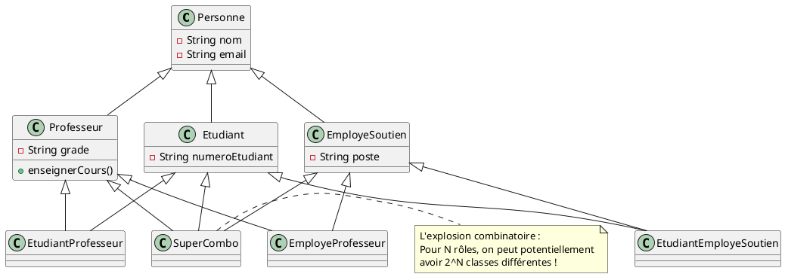
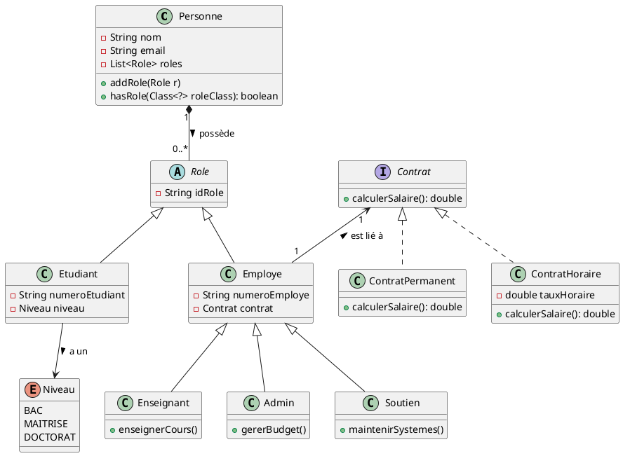

# Modélisation Avancée et la Gestion des Rôles

## 1. Le Problème : L'Identité vs Le Rôle

Dans la section précédente, nous avons utilisé une hiérarchie simple : une `Personne` peut être un `Etudiant` ou un
`Professeur`. Cette approche fonctionne tant que les catégories sont **mutuellement exclusives** (on est soit l'un, soit
l'autre).

Cependant, dans la réalité, une personne peut occuper **plusieurs rôles simultanément** :

* Un étudiant aux cycles supérieurs peut être **auxiliaire d'enseignement** (il est donc Étudiant ET Professeur).
* Un technicien informatique peut donner un cours de spécialisation (il est donc Employé TI ET Professeur).

### Le piège de la double instance

Une solution naïve serait de créer deux objets : un objet `Etudiant` et un objet `Professeur` liés par un identifiant.
**Pourquoi est-ce une mauvaise idée ?**

- **Synchronisation :** Si la personne change d'adresse, il faut mettre à jour deux objets différents.
- **Identité :** La personne est une seule entité physique et juridique. Avoir deux objets pour une seule personne
  fragmente la vérité des données.

---

## 2. Tentative de solution : L'Héritage (et l'Héritage Multiple)

Pour éviter d'avoir deux objets, on peut tenter de créer des classes qui représentent la combinaison des rôles. On
utilise alors l'héritage pour "fusionner" les propriétés.

### L'explosion combinatoire des classes

Si on suit cette logique, dès qu'un nouveau rôle apparaît ou qu'une personne combine des rôles, on doit créer une
nouvelle classe.

**Imaginons les rôles suivants :**

- Étudiant
- Professeur
- Employé de soutien (TI, Administration, etc.)

**Pour gérer les combinaisons, on se retrouve avec :**

- `EtudiantProfesseur` (L'étudiant qui enseigne)
- `EmployeProfesseur` (L'employé qui enseigne)
- `EtudiantEmployeSoutien` (L'étudiant qui travaille aux TI)
- `EtudiantProfesseurEmployeSoutien` (L'étudiant qui enseigne et travaille aux TI)

### Diagramme UML de l'explosion des classes

---

## 3. Analyse critique de l'approche par héritage

Cette approche, bien que possible dans certains langages comme C++ ou Python, présente des défauts majeurs :

### A. Rigidité structurelle

L'héritage est défini à la **compilation**. Si un `Etudiant` devient `Professeur` durant l'année, on ne peut pas
simplement "ajouter" l'héritage à l'objet existant. Il faudrait détruire l'objet `Etudiant` et créer un nouvel objet
`EtudiantProfesseur` en recopiant toutes les données.

### B. Maintenance impossible

À chaque nouveau rôle ajouté au système (ex: `Chercheur`, `Administrateur`), le nombre de classes hybrides potentielles
double. Le code devient un labyrinthe de classes spécialisées où il est impossible de savoir quelle classe utiliser pour
quelle personne.

### C. Violation du principe de conception

On tente d'utiliser l'héritage pour gérer un **état dynamique** (le rôle d'une personne peut changer avec le temps)
alors que l'héritage est conçu pour définir une **nature statique**.

---

### Transition pour la suite du cours :

L'héritage a échoué ici car il tente de définir "ce que la personne EST" au lieu de "ce que la personne FAIT". Pour
résoudre ce problème, nous devons passer d'une approche basée sur l'héritage à une approche basée sur la **Composition**
et le **Pattern État/Rôle**.

---

## La Solution : Composition de Rôles et Hiérarchie de Fonctions

Pour résoudre l'explosion des classes et la rigidité de l'héritage multiple, nous changeons de paradigme : on sépare l'
**Identité** (la Personne) des **Fonctions** (les Rôles).

### 1. Le concept de Composition

L'objet `Personne` ne "devient" plus un étudiant ou un professeur via l'héritage. Il **possède** une collection de
rôles.

**Avantages immédiats :**

- **Multi-rôle :** Une personne peut être simultanément Étudiante et Enseignante sans créer de classe hybride.
- **Dynamisme :** On peut ajouter ou retirer un rôle à une personne pendant l'exécution du programme (ex: un étudiant
  qui devient employé).
- **Simplicité :** Le nombre de classes reste constant, peu importe le nombre de combinaisons possibles.

### 2. Structure de la Hiérarchie des Rôles

L'héritage est utilisé ici de manière appropriée pour organiser les types de rôles, car il y a une réelle relation "Est
un".

- **`Role` (Classe Abstraite)** : Définit la base commune à tout rôle.
    - **`Etudiant`** : Ajoute des spécificités (ex: `Niveau` via un `Enum` : BAC, MAÎTRISE, DOCTORAT).
    - **`Employe`** : Ajoute des spécificités liées au travail.
        - **`Enseignant`**, **`Admin`**, **`Soutien`** : Spécialisations de l'employé.

### 3. Gestion des contrats et des attributs

Pour rendre le système encore plus flexible, on utilise :

- **Interfaces pour les contrats** : Un employé possède un contrat. En utilisant une interface `Contrat`, on peut avoir
  différents types (Contrat Permanent, Contrat Horaire, Contrat Temporaire) sans modifier la classe `Employe`.
- **Enums pour les niveaux** : Pour les valeurs fixes et prédéfinies.

---

### Diagramme de Classes UML

---

### Analyse des bénéfices de ce design

| Problème précédent        | Solution avec Composition                   | Pourquoi c'est mieux ?                                   |
|:--------------------------|:--------------------------------------------|:---------------------------------------------------------|
| **Double instance**       | Une seule instance `Personne`.              | Cohérence des données (une seule adresse, un seul nom).  |
| **Explosion des classes** | On a $N$ classes de rôles au lieu de $2^N$. | Maintenance simplifiée et code plus lisible.             |
| **Rigidité du type**      | `personne.addRole(new Enseignant())`        | Changement de rôle possible à l'exécution.               |
| **Conflits d'héritage**   | Plus d'héritage multiple.                   | Plus de problème du "Diamant" ou d'ambiguïté de méthode. |

### Exemple de flux logique pour les étudiants :

*"Si Jean est un étudiant au doctorat qui donne un cours et qui aide occasionnellement aux TI :"*

1. On crée une instance `Personne` (Jean).
2. On lui ajoute un rôle `Etudiant` avec le niveau `DOCTORAT`.
3. On lui ajoute un rôle `Enseignant` avec un `ContratHoraire`.
4. On lui ajoute un rôle `Soutien` avec un `ContratHoraire`.

**Jean est maintenant un objet unique qui possède trois capacités différentes. Le système est totalement flexible.**